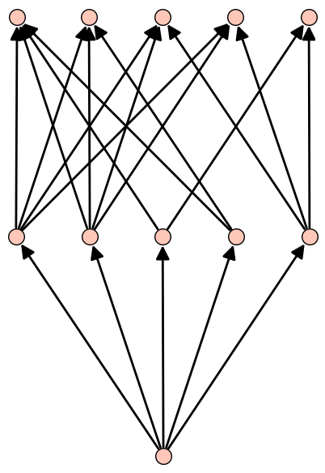

# Arithmat
Sage implementation of arithmetic matroids and toric arrangements.

Authors: Giovanni Paolini and Roberto Pagaria

* [Requirements](#requirements)
* [Quick start](#quick-start)
* [Overview](#overview)
* [Documentation](#documentation)
  + [Import](#import)
  + [Available classes for arithmetic matroids](#available-classes-for-arithmetic-matroids)
  + [Available methods](#available-methods)
* [Bibliography](#bibliography)
* [License](#license)


## Requirements

* [Python](https://www.python.org/) 2.7
* [Sage](http://www.sagemath.org/) >= 8
* The Python package `networkx` (can be installed with `sage --python -m easy_install networkx` or `sage --python -m pip install networkx`)

## Quick start
...

## Overview

Arithmat is a Sage package that implements arithmetic matroids.
At its core there is the class `ArithmeticMatroidMixin`, which is intended to be used in combination with [any existing matroid class of Sage](http://doc.sagemath.org/html/en/reference/matroids/index.html) (e.g. `RankMatroid`, `BasisMatroid`, `LinearMatroid`) via multiple inheritance.
The most common combinations are already defined: `ArithmeticMatroid` (deriving from `RankMatroid`), `BasisArithmeticMatroid` (deriving from `BasisMatroid`), and `LinearArithmeticMatroid` (deriving from `LinearMatroid`).
An additional class `ToricArithmeticMatroid` is implemented, for arithmetic matroids constructed from a fixed given representation.

## Documentation

### Import

All defined classes can be imported at once:
```sage
from arithmat import *
```
Alternatively, it is possible to import only specific classes. For example:
```sage
from arithmat import ArithmeticMatroid, ToricArithmeticMatroid
```


### Available classes for arithmetic matroids

All classes for arithmetic matroids derive from `ArithmeticMatroidMixin` and from some subclass of Sage's `Matroid`.
The class `ArithmeticMatroidMixin` is not intended to be used by itself, but it is possible to subclass it in order to create new classes for arithmetic matroids.

The classes which are already provided in `arithmat` are the following.

* `ArithmeticMatroid(groundset, rank_function, multiplicity_function)`

  This is the simplest arithmetic matroid class, and derives from `ArithmeticMatroidMixin` and `RankMatroid`.
  Example:
  ```sage
  E = [1,2,3,4,5]

  def rk(X):
      return min(2, len(X))

  def m(X):
      if len(X) == 2 and all(x in [3,4,5] for x in X):
          return 2
      else:
          return 1

  M = ArithmeticMatroid(E, rk, m)
  print M
  # Arithmetic matroid of rank 2 on 5 elements

  print M.arithmetic_tutte_polynomial()
  # y^3 + x^2 + 2*y^2 + 3*x + 3*y + 3

  print M.representation()
  # None (this arithmetic matroid is not representable)
  ```
* `ToricArithmeticMatroid(arrangement_matrix, torus_matrix=None, ordered_groundset=None)`

  Arithmetic matroid associated to a given toric arrangement. This class derives from `ArithmeticMatroidMixin` and `Matroid`.

  The constructor requires an integer matrix `arrangement_matrix` representing the toric arrangement. Otionally it accepts another integer matrix `torus_matrix` (whose cokernel describes the ambient torus, and defaults to `matrix(ZZ, arrangement_matrix.nrows(), 0)`) and/or an ordered copy `ordered_groundset` of the groundset (defaults to `range(matrix.ncols())`). The number of rows of `arrangement_matrix` must be equal to the numer of rows of `torus_matrix`.

  The two matrices are not guaranteed to remain unchanged: internally,`torus_matrix` is kept in Smith normal form (this also affects `arrangement_matrix`).

  Example:
  ```sage
  A = matrix(ZZ, [[-1, 1, 0, 2], [3, 1, -1, -2]])
  M = ToricArithmeticMatroid(A)

  print M
  # Toric arithmetic matroid of rank 2 on 4 elements

  print M.arrangement_matrix()
  # [-1  1  0  2]
  # [ 3  1 -1 -2]

  print M.torus_matrix()
  # []

  P = M.poset_of_layers()
  print P
  # Finite poset containing 11 elements

  P.show(label_elements=False)
  ```
  

  ```sage
  Q = matrix(ZZ, [[5], [1]])
  N = ToricArithmeticMatroid(A, Q)

  print N
  # Toric arithmetic matroid of rank 1 on 4 elements

  print N.arrangement_matrix()
  # [-16  -4   5  12]

  print N.torus_matrix()
  # []

  ```

The classes `BasisArithmeticMatroid` and `LinearArithmeticMatroid` derive from the Sage classes `BasisMatroid` and `LinearMatroid`, respectively.
An instance of `XxxArithmeticMatroid` can be constructed with `XxxArithmeticMatroid(..., multiplicity_function=m)`, where `...` should be replaced by arguments to construct an instance of `XxxMatroid`, and `m` is the multiplicity function.
The multiplicity function needs to be passed as a keyword argument (and not as a positional argument).

* `BasisArithmeticMatroid(M=None, groundset=None, bases=None, ..., multiplicity_function)`

   ```sage
   def m(X):
       if len(X) == 2 and all(x in ['b','c','d'] for x in X):
           return 2
       else:
           return 1

   M = BasisArithmeticMatroid(groundset='abcd', bases=['ab', 'ac', 'ad', 'bc', 'bd', 'cd'], multiplicity_function=m)

   print M
   # Basis arithmetic matroid of rank 2 on 4 elements

   print M.is_valid()
   # True
   ```

   It is possible to cast any arithmetic matroid to a `BasisArithmeticMatroid`:

   ```sage
   M1 = ToricArithmeticMatroid(matrix(ZZ, [[-1, 1, 0, 7], [6, 1, -1, -2]]))
   M2 = BasisArithmeticMatroid(M1)

   print M1
   # Toric arithmetic matroid of rank 2 on 4 elements

   print M2
   # Basis arithmetic matroid of rank 2 on 4 elements

   print M2.full_multiplicity() == M1.full_multiplicity()
   # True
   ```

* `LinearArithmeticMatroid(matrix=None, groundset=None, ..., multiplicity_function)`

  ```sage
  A = matrix(GF(2), [[1, 0, 0, 1, 1], [0, 1, 0, 1, 0], [0, 0, 1, 0, 1]])

  def m(X):
      return 1

  M = LinearArithmeticMatroid(A, multiplicity_function=m)

  print M
  # Linear arithmetic matroid of rank 3 on 5 elements

  print M.is_valid()
  # True
  ```

Finally, `MinorArithmeticMatroid` and `DualArithmeticMatroid` are the analogs of `MinorMatroid` and `DualMatroid`.

* `MinorArithmeticMatroid`
* `DualArithmeticMatroid`


### Available methods

All classes for arithmetic matroids must also derive from some subclass of Sage's `Matroid`.
In particular, `Matroid` methods are still available. For example:
```sage
M = ToricArithmeticMatroid(matrix(ZZ, [[1,2,3], [0,1, 1]]))
print list(M.bases())
# [frozenset([0, 1]), frozenset([0, 2]), frozenset([1, 2])]
```

All subclasses of `ArithmeticMatroidMixin` also (re-)implement the following methods.

* `multiplicity(X)`
  Return the multiplicity of the set `X`.

* `full_multiplicity()`
  Return the multiplicity of the groundset.

* `is_valid()`
  Check if the arithmetic matroid axioms are satisfied.
  This method overwrites `Matroid.is_valid`.

* `is_torsion_free()`
  Check if the matroid is torsion-free, i.e. the multiplicity of the empty set is equal to 1.

* `is_surjective()`
  Check if the matroid is surjective, i.e. the multiplicity of the groundset is equal to 1.

* `is_gcd()`
  Check if the matroid satisfies the gcd property.

* `is_strong_gcd()`
  Check if the matroid satisfies the strong gcd property, as defined in [PP19].

* `is_isomorphism(other, morphism)`
  Check if the given morphism of groundsets is an isomoprhism of arithmetic matroids.
  It works also when comparing instances of different subclasses of `ArithmeticMatroid`.
  This method overwrites `Matroid.is_isomorphism`.

* `delete(X)`
  Delete elements.
  This method overwrites `Matroid.delete`.

* `contract(X)`
  Contract elements.
  This method overwrites `Matroid.contract`.

* `dual()`
  Return the dual of the matroid.
  This method overwrites `Matroid.dual`.

* `arithmetic_tutte_polynomial(x=None, y=None)`
  Return the arithmetic Tutte polynomial of the matroid.

* `reduction()`
  Return the reduction of the matroid, as defined in [PP19].

* `check_representation(A, ordered_groundset=None)`
  Check if the given integer matrix `A` is a representation of the matroid.
  The optional parameter `ordered_groundset` specifies the bijection between the columns of the matrix and the groundset.

* `all_representations(ordered_groundset=None)`
  Generator of all non-equivalent essential representations of the matroid, computed using the algorithm described in [PP19].

* `num_representations()`
  Return the number of non-equivalent essential representations of the matroid.
  This is not faster than `all_representations`.

* `representation(ordered_groundset=None)`
  Return any essential representation of the matroid, or `None` if the matroid is not representable.

* `is_representable()`
  Check if the matroid is representable.
  This is not faster than `representation`.

* `is_orientable()`
  Check if the matroid is orientable as an arithmetic matroid, according to [Pag18a].

In addition, `ToricArithmeticMatroid` has the following method.

* `poset_of_layers()`
  Return the poset of layers of the toric arrangement, computed using Lenz's algorithm [Len17a].


## Bibliography

[BM14] P. Brändén and L. Moci, *The multivariate arithmetic Tutte polynomial*, Transactions of the American Mathematical Society **366** (2014), no. 10, 5523–5540.

[DM13] M. D'Adderio and L. Moci, *Arithmetic matroids, the Tutte polynomial and toric arrangements*, Advances in Mathematics **232** (2013), 335–367.

[DD18] A. D'Alì and E. Delucchi, *Stanley-Reisner rings for symmetric simplicial complexes, G-semimatroids and Abelian arrangements*, ArXiv preprint 1804.07366 (2018).

[DGP17] E. Delucchi, N. Girard, and G. Paolini, *Shellability of posets of labeled partitions and arrangements defined by root systems*, ArXiv preprint 1706.06360 (2017).

[Len17a] M. Lenz, *Computing the poset of layers of a toric arrangement*, ArXiv preprint 1708.06646 (2017).

[Len17b] M. Lenz, *Representations of weakly multiplicative arithmetic matroids are unique*, ArXiv preprint 1704.08607 (2017).

[Len17c] M. Lenz, *Stanley-Reisner rings for quasi-arithmetic matroids*, ArXiv preprint 1709.03834 (2017).

[Mar18] I. Martino, *Face module for realizable Z-matroids*, Contributions to Discrete Mathematics **13** (2018).

[Pag17] R. Pagaria, *Combinatorics of Toric Arrangements*, ArXiv preprint 1710.00409 (2017).

[Pag18a] R. Pagaria, *Orientable arithmetic matroids*, ArXiv preprint 1805.11888 (2018).

[Pag18b] R. Pagaria, *Two Examples of Toric Arrangements*, ArXiv preprint 1804.05767 (2018).

[PP19] R. Pagaria and G. Paolini, *??*, ArXiv preprint ?? (2019).


## License

This project is licensed under the [GNU General Public License v3.0](LICENSE.md).
